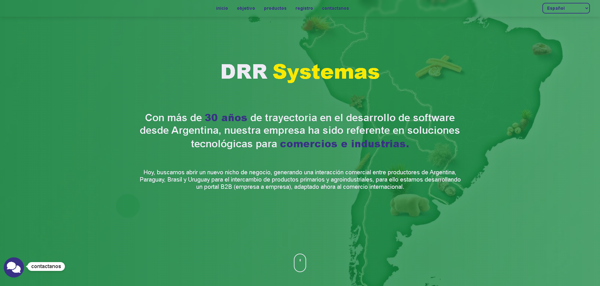

# 💼 Drr Internacional

A growing web application project aims to generate commercial interaction between producers in Argentina, Paraguay, Brazil, and Uruguay. 

---

## 📌 Description
This is my personal portfolio, designed and developed with **Angular** to highlight my projects and professional profile.  
The main goals of this project were to:  
- Practice and deepen my knowledge of **Angular** and **TypeScript**  
- Apply concepts of **component-based architecture** and **responsive design**  
- Build a professional space to showcase my work and technical skills  

---

## 🛠 Technologies used
- **.net** (framework)
- **C#** (lnaguaje)
- **JavaScript** (interactivity)  
- **HTML5** (markup)  
- **CSS3** (styling and responsive design)  
- **Visual Studio** (development environment)  
- **Github Pages** (deployment and hosting)  

---

## ✨ Features
- Responsive and modern design
- Custom-built components from scratch
- Clean and organized project structure
- Optimized performance for deployment on GitHub Pages
- Integrated contact form with Email.js, allowing for direct and secure communication without a backend.
- Multilingual support for 3 languages, enabling the application to reach a broader audience.
- Reusable and modular components for easy maintenance and future scalability.

---

## 🌐 Live Demo
You can view the live version of this portfolio here:
👉 [danielcoronelpv.github.io/drr-internacional/](https://danielcoronelpv.github.io/drr-internacional/)

---

## 📸 Preview


---

## 🚀 How to run this project
```bash
# Clone the repository
git clone https://github.com/DanielCoronelPV/drr-internacional.git

# Navigate into the project folder
cd drr-internacional

# Run the development server
dotnet watch run

# The app will be available at
http://localhost:5089/
```

---

## 📁 Structure
```bash
/project-root
│
├── wwwroot
│   ├── assets
│   │   ├── css
│   │   └── js
│   ├── favicon.ico
│   └── index.html
├── Components
│   └── LanguageSelector.razor
├── Layout
│   ├── Footer.razor
│   ├── Header.razor
│   ├── MainLayout.razor
│   └── Shared.razor
├── Models
│   ├── Credencial.cs
│   ├── Empresa.cs
│   └── EmpresaResponse.cs
├── Pages
│   ├── Contact.razor
│   ├── Hero.razor
│   ├── Objetivo.razor
│   ├── Productos.razor
│   └── Registro.razor
├── Services
│   ├── EmpresaService.cs
│   └── TranslationService.cs
├── .gitignore
├── _Imports.razor
├── App.razor
└── Program.cs
```
